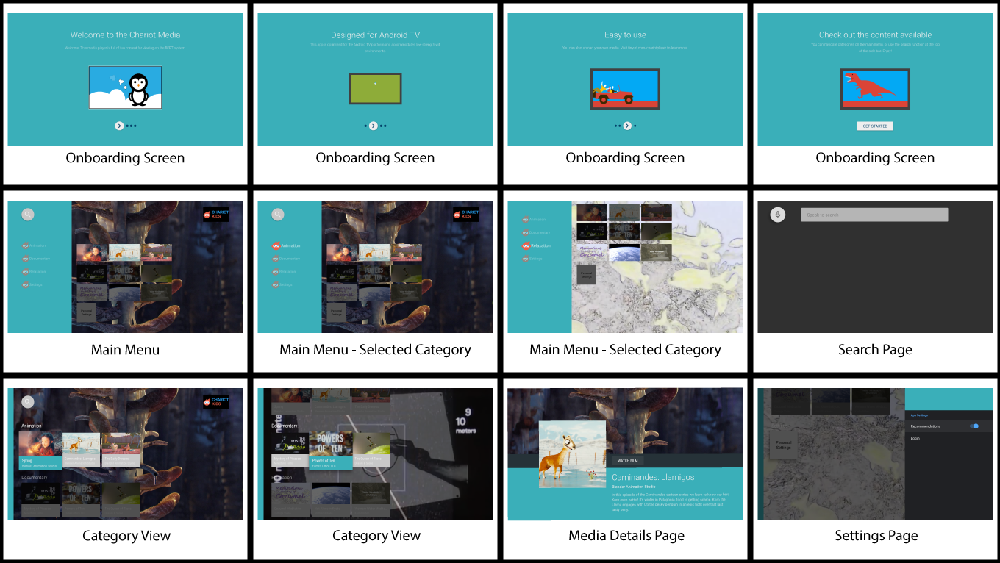

## Chariot Media Player using Android TV Leanback Support Library

This is a media player app designed to run on an Android TV device, in our case the Nebula Capsule II by Anker. This app is meant to serve as a streaming-free media player with a user-friendly UI that complies with the UX guidelines of Android TV. App content is currently all sourced under Creative Commons license and provided to the app via user input into a Google Spreadsheet. Sheet content is converted into a JSON which the app takes as input along with direct links to all media files. Content is refreshed only when WiFi is suitable and all content is usable.


## Getting Started

- Clone this repo:

```sh
git clone https://github.com/rawitscher/chariot_media.git
```

- Open the project in [Android Studio][studio].
- Compile and deploy to your Android TV device.

Need more information about getting started with Android TV? Check the [official docs][getting-started].

## Explore the app

- Home Menu
  - [Onboard][onboardingfragment] new users (explain new features)
  - Videos grouped by [category][mainfragment] (See BrowseFragment in [screenshots][screenshots])
  - [Search][searchfragment] within your app
    - Review searchable training [document][searchable]
     - Creating a [content provider][videoprovider]
     - Defining [searchable.xml][searchable.xml]
     - Receive search intent in [manifest][manifestsearch]
- View a Video
  - Customize video cards with a [Card Presenter][cardpresenter] (See Card Views in [screenshots][screenshots])
  - Display in-depth [details][detailsfragment] about your video
- Play a Video
  - [Playback with ExoPlayer2][playbackfragment]
  - [Add extra buttons to control playback][videoplayerglue]
- [Display an error][errorfragment]
- Customize [preference and settings][settingsfragment]


[onboardingfragment]: https://github.com/rawitscher/chariot_media/blob/master/app/src/main/java/com/example/android/tvleanback/ui/OnboardingFragment.java

[mainfragment]: https://github.com/rawitscher/chariot_media/blob/master/app/src/main/java/com/example/android/tvleanback/ui/MainFragment.java

[screenshots]: https://github.com/rawitscher/chariot_media#screenshots

[searchfragment]: https://github.com/rawitscher/chariot_media/blob/master/app/src/main/java/com/example/android/tvleanback/ui/SearchFragment.java

[searchable]: https://developer.android.com/training/tv/discovery/searchable.html

[videoprovider]: https://github.com/rawitscher/chariot_media/blob/master/app/src/main/java/com/example/android/tvleanback/data/VideoProvider.java

[searchable.xml]: https://github.com/rawitscher/chariot_media/blob/master/app/src/main/res/xml/searchable.xml

[manifestsearch]: https://github.com/rawitscher/chariot_media/blob/master/app/src/main/AndroidManifest.xml#L79

[cardpresenter]: https://github.com/rawitscher/chariot_media/blob/master/app/src/main/java/com/example/android/tvleanback/presenter/CardPresenter.java

[detailsfragment]: https://github.com/rawitscher/chariot_media/blob/master/app/src/main/java/com/example/android/tvleanback/ui/VideoDetailsFragment.java

[playbackfragment]: https://github.com/rawitscher/chariot_media/blob/master/app/src/main/java/com/example/android/tvleanback/ui/PlaybackFragment.java

[videoplayerglue]: https://github.com/rawitscher/chariot_media/blob/master/app/src/main/java/com/example/android/tvleanback/player/VideoPlayerGlue.java

[errorfragment]: https://github.com/rawitscher/chariot_media/blob/master/app/src/main/java/com/example/android/tvleanback/ui/BrowseErrorFragment.java

[settingsfragment]: https://github.com/rawitscher/chariot_media/blob/master/app/src/main/java/com/example/android/tvleanback/ui/SettingsFragment.java


## Additonal Resouroces

- [Android TV Introduction](http://www.android.com/tv/)
- [Android TV Developer Documentation](http://developer.android.com/tv)
- [Android TV Apps in Google Play Store][store-apps]


## Screenshots

[](https://raw.githubusercontent.com/rawitscher/chariot_media/master/screenshots/chariot_main_screen.png)


## Dependencies

If you use Android Studio as recommended, the following dependencies will **automatically** be installed by Gradle.

- Android SDK v7 appcompat library
- Android SDK v17 leanback support library
- Android SDK v7 recyclerview library


## License

Licensed under the Apache 2.0 license. See the [LICENSE file][license] for details.

[store-apps]: https://play.google.com/store/apps/collection/promotion_3000e26_androidtv_apps_all
[studio]: https://developer.android.com/tools/studio/index.html
[getting-started]: https://developer.android.com/training/tv/start/start.html
[bugs]: https://github.com/rawitscher/chariot_media/issues/new
[license]: LICENSE
